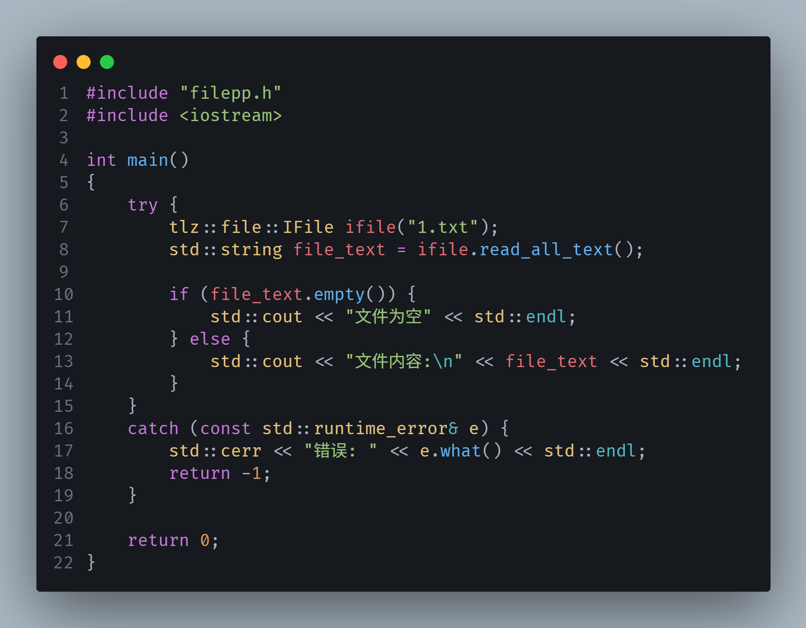
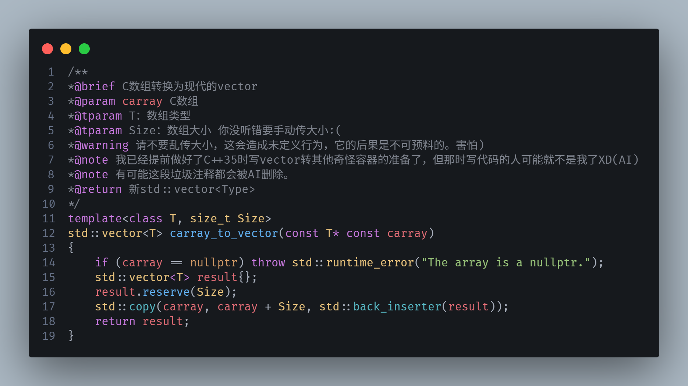
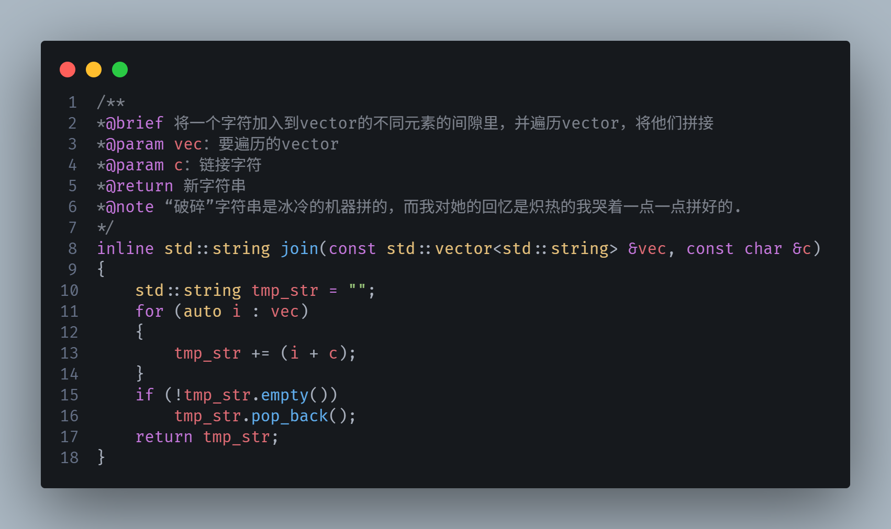
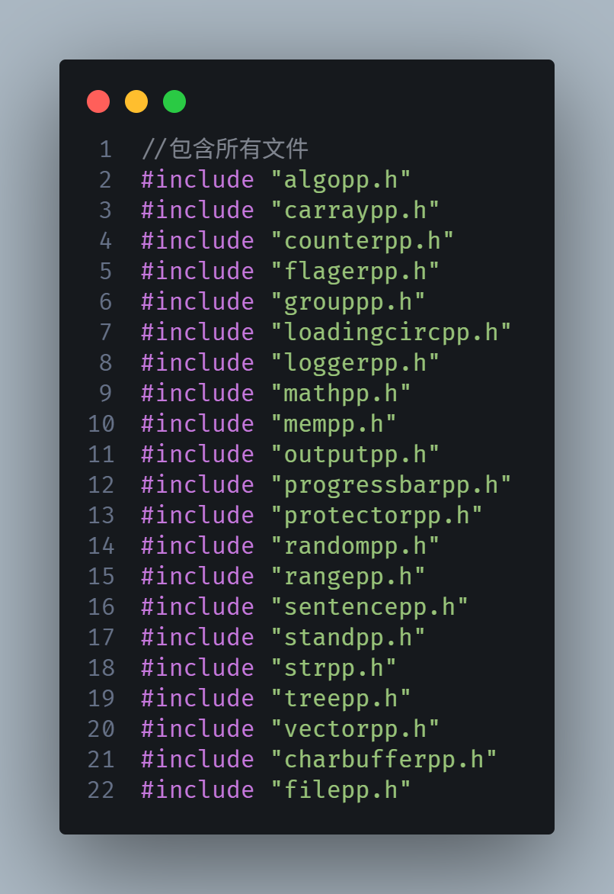

# toolzpp - C++ toollib

A lightweight, header-only C++ utility library that provides commonly used functions and data structures for daily development.

### Introduction

* This is my first work: a lightweight, header-only C++ utility library that provides commonly used functions and data structures for daily development, such as string processing/formatting, random number generation, algorithms, etc. See the project for details. I have been learning C++ for 3 months, so there may be some poorly written parts. Feedback is welcome!

* Welcome to the Toolzpp C++ library! We are very glad to see you using this library! This library already has 21 files and 2200 lines of code! Here, you can use C more conveniently. The Toolzpp source code has complete comments, and if you have any doubts, looking at the source code comments is the best choice.

## Features

- **Header-only**: Just include the headers, no compilation needed
- **C++17** standard
- **No third-party dependencies**
- **Namespace isolation**: All features under `tlz::` namespace
 

## Quick Start

```c++
#include "toolzpp.h"
#include <iostream>
using tlz::operator<<;

int main() {
    // String processing
    std::string str = "hello world";
    std::cout << tlz::str::upper(str) << std::endl;  // "HELLO WORLD"
    
    // String split
    auto parts = tlz::str::split("a,b,c", ',');
    
    // Random number
    tlz::random::Randomer rng;
    int num = rng.randint(1, 100);
    
    // Container operations
    std::vector<int> vec = {1, 2, 3, 4, 5};
    auto sum = tlz::math::vector_sum(vec);      // 15
    auto avg = tlz::math::average(vec);         // 3.0
    
    // Print vector
    std::cout << vec << std::endl;               // [1,2,3,4,5]
    
    return 0;
}
```

### imgs
 

 
----------------------------------------------------------------------------
# toolzpp - C++ toollib

一个轻量级、 header-only 的 C++ 工具库，提供日常开发中常用的函数和数据结构。
### 介绍
* 这是我的第一个作品：一个轻量级、 header-only 的 C++ 工具库，提供日常开发中常用的函数和数据结构，例如字符串处理/格
式化，随机数产生，算法等，具体可见项目。本人学习C++3个月，所以有些写的不好的地方，欢迎反馈！

* This is my first work: a lightweight, header-only C++ utility library that provides commonly used functions and data structures for daily development. I am still learning, so there may be some poorly written parts, feedback is welcome!

* 欢迎使用Toolzpp C++工具库!很高兴看见您使用这个库!本库已有22个文件，3800行代码!在这里，你能
更快捷的使用C++，Toolzpp源代码拥有完善的注释，如果你有任何疑惑的地方，看源码注释便是最好选择

## 特性

- **Header-only**：只需包含头文件，无需编译
- **C++17** 标准
- **无第三方依赖**
- **命名空间隔离**：所有功能在 `tlz::` 命名空间下

## 快速开始

```c++
#include "toolzpp.h"
#include <iostream>
using tlz::operator<<;

int main() {
    // 字符串处理
    std::string str = "hello world";
    std::cout << tlz::str::upper(str) << std::endl;  // "HELLO WORLD"
    
    // 字符串分割
    auto parts = tlz::str::split("a,b,c", ',');
    
    // 随机数
    tlz::random::Randomer rng;
    int num = rng.randint(1, 100);
    
    // 容器操作
    std::vector<int> vec = {1, 2, 3, 4, 5};
    auto sum = tlz::math::vector_sum(vec);      // 15
    auto avg = tlz::math::average(vec);         // 3.0
    
    // 输出 vector
    std::cout << vec << std::endl;               // [1,2,3,4,5]
    
    return 0;
}
```

### 图片
 

 

## 模块
**模块列表**
 
* tips:charbuffer目前正在开发中

## 使用，编译
**使用**
- 直接包含，无需链接
- C++17及以上
- 命名空间: tlz
----------------------------------------------------------------------------